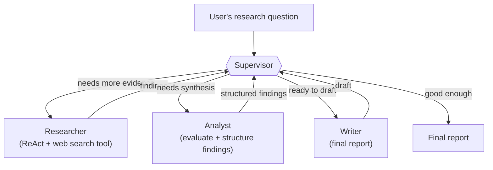

# Multi-Agent AI Research System

A research assistant built as a team of small, specialized AI agents — a Supervisor, a Researcher, an Analyst, and a Writer — coordinated with **LangGraph** on top of **LangChain**, running entirely on a **local, open-source LLM via Ollama**. You ask a research question; the system searches, evaluates what it finds, synthesizes it, and hands back a structured report — with no data leaving the machine and no per-token API bill.

This repo is also a learning-in-public build: every module and every implementation step is documented as it happens in [`.docs/BUILD_LOG.md`](.docs/BUILD_LOG.md), including the reasoning behind each decision and the trade-offs against the alternatives.

## Status

**In progress — Modules 1–3 of 4 complete.**

| Module | Covers | Status |
|---|---|---|
| 01 — Concepts & Foundations | Agents, multi-agent design, LangChain primitives, why LangGraph, reasoning patterns, memory, tool-calling | ✅ Done |
| 02 — Architecture (HLD & LLD) | Agent responsibilities, sequence flow, state schema, routing logic, search-tool choice, guardrails | ✅ Done |
| 03 — Interview Prep | Tech-stack trade-offs, local vs. hosted LLM, scaling, evaluation, security, rapid-fire Q&A | ✅ Done |
| 04 — Implementation | Actual code, step by step, tested and demoed | 🔧 In progress (roadmap locked, Step 1 next) |

Nothing under "Getting started" below is runnable yet — this section is written honestly ahead of the code and will be replaced with real, tested commands as Module 04 lands.

## The problem

Doing real research with an LLM by hand-holding a single prompt breaks down fast: one prompt trying to search, judge source quality, cross-reference conflicting claims, *and* write a well-structured report ends up doing all four jobs poorly, in a context window fighting itself for space. A single agent with a pile of tools helps, but the same four jobs still share one system prompt and one failure surface — when the output is bad, it's hard to tell whether the search was weak, the source judgment was wrong, or the writing misrepresented good findings.

## Why this project

Built to go deep on **agentic AI system design** — not just call an LLM API, but design the control flow, state, and failure handling around it — using a real, portfolio-worthy build instead of toy examples. Two concrete goals:

1. Learn LangChain/LangGraph multi-agent architecture thoroughly enough to defend every design decision in an interview — why multi-agent over single-agent, why LangGraph over a plain chain, why a Supervisor pattern, why local inference.
2. End up with a working, runnable system: a genuine research assistant, not just a set of notes.

## Approach & architecture

The core pattern is **Supervisor-routed multi-agent**, chosen because the research task itself decomposes cleanly into four different jobs with four different failure modes:



- **Supervisor** — routes to the right specialist next and decides when the answer is ready. This is the piece that requires LangGraph: it needs to loop back to an agent it already visited and decide the next step from live state, which a plain LangChain chain (a fixed, one-directional pipeline) structurally cannot do.
- **Researcher** — runs a ReAct loop (think → search → observe → repeat) against a web search tool until it has enough to hand off.
- **Analyst** — turns raw findings into a typed, structured object (source, claim, confidence) instead of a loose paragraph, so downstream agents get clean data, not text to re-parse.
- **Writer** — produces the final report from the Analyst's structured findings. An optional **Reflection** pass can send a weak draft back for another research round — off by default, since it roughly doubles the cost of a run.

Full HLD/LLD — state schema, routing logic, search-tool trade-off, error handling and guardrails — is written up in [`.docs/BUILD_LOG.md`](.docs/BUILD_LOG.md#module-02--architecture-hld--lld--recap).

## Tech stack

| Layer | Choice | Why (short version — full trade-off analysis in the build log) |
|---|---|---|
| Orchestration primitives | **LangChain** | Prompts, tool-calling, structured output, and a provider-agnostic chat-model interface |
| Multi-agent control flow | **LangGraph** | Adds the cycles and run-time-conditional routing a Supervisor needs, which LangChain's linear LCEL chains can't express |
| LLM runtime | **Ollama** (local, open-source model) | No per-token cost, no data leaves the machine; trade-off is weaker tool-calling reliability than a hosted frontier model, addressed with explicit retry/repair logic |
| Language | **Python** | LangChain/LangGraph's primary, most complete SDK |
| Long-term memory *(planned)* | Vector store (candidate: Chroma) | Retrieval of past research by semantic similarity across sessions |

## Reasoning patterns in play

- **ReAct** — inside the Researcher's own tool-use loop
- **Reflection** — optional critique pass after the Writer
- **Supervisor / Orchestrator** — the system's top-level control flow
- **Plan-and-Execute** — deliberately *not* used as the top-level pattern; the Supervisor decides one step at a time so it can react to what the Researcher actually finds, rather than committing to a rigid upfront plan

## Repository layout

Locked (Module 04 roadmap) — filled in as each build step lands:

```
.
├── .docs/BUILD_LOG.md   # running build log + interview-prep Q&A (grows with every module/step)
├── .env.example
├── requirements.txt
├── src/
│   ├── state.py           # ResearchState, Finding
│   ├── llm.py              # ChatOllama client
│   ├── tools.py             # web_search (ddgs)
│   ├── agents/
│   │   ├── supervisor.py
│   │   ├── researcher.py
│   │   ├── analyst.py
│   │   └── writer.py
│   ├── graph.py             # StateGraph wiring
│   └── main.py              # CLI entrypoint
├── tests/
├── .gitignore
└── README.md
```

## Getting started

Not fully runnable yet — code is landing step by step (tracked in [`.docs/BUILD_LOG.md`](.docs/BUILD_LOG.md)). Once it is:

1. Install [Ollama](https://ollama.com) and pull a tool-calling-capable model (e.g. `ollama pull llama3.1`)
2. `pip install -r requirements.txt`
3. `python -m src.main "your research question"`

This section gets its final, verified commands once Step 7 (the CLI entrypoint) lands.

## Outcome & impact

This is a learning and portfolio project, not a deployed product, so "impact" is measured honestly on that basis: a working local multi-agent research assistant that runs end to end, a documented, defensible architecture (every choice traceable to a stated trade-off, not a default), and a reusable Supervisor-pattern skeleton that generalizes past this one project to any workflow that decomposes into specialist roles.
